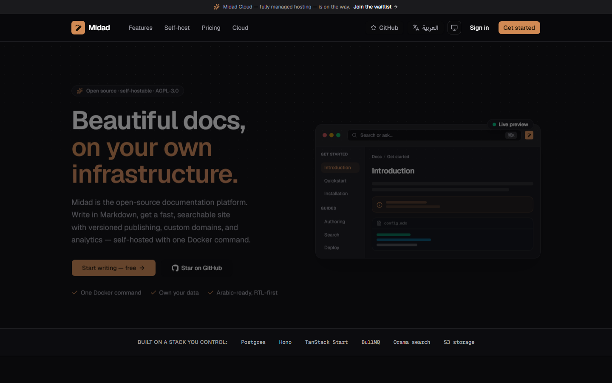
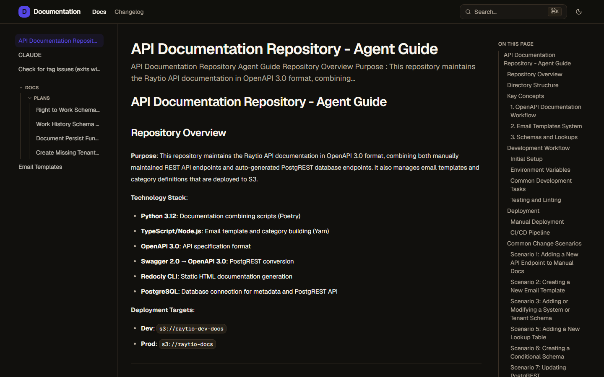
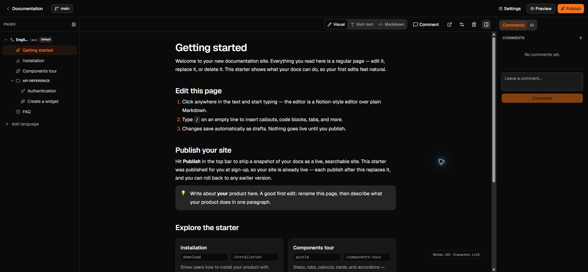

<div align="center">

<picture>
  <source media="(prefers-color-scheme: dark)" srcset="apps/app/public/brand/nibleaf-logo-horizontal-ltr-reverse.svg" />
  
</picture>

### The open-source Mintlify alternative

Nibleaf is an open-source, self-hostable documentation platform — an alternative
to Mintlify and GitBook — with a rich-text editor over Markdown/MDX,
first-class Arabic/RTL support, custom domains, and a free cloud beta at
[nibleaf.com](https://nibleaf.com).

[](LICENSE)
[](https://github.com/lord007tn/nibleaf/releases)
[](https://github.com/lord007tn/nibleaf/actions/workflows/ci.yml)
[](https://github.com/lord007tn/nibleaf/pkgs/container/nibleaf)

[Homepage](https://nibleaf.com) · [Documentation](https://docs.nibleaf.com) · [Quick start](#-quick-start) · [Features](#-features) · [Self-host](https://docs.nibleaf.com/getting-started/self-hosted) · [Architecture](#️-architecture) · [Contributing](CONTRIBUTING.md)

<br />



</div>

---

## What is Nibleaf?

Nibleaf lets you write documentation in Markdown/MDX, organize it into a navigable tree,
and publish a fast, searchable, multilingual site — with versioned deploys, custom
domains, per-site teams, and analytics. Run it with the guided installer or Docker
Compose, or use the hosted beta. It's the docs platform you can operate end to end:
no per-seat pricing for the self-hosted edition, no proprietary content format, and
your content stays in your database.

- 🖋️ **Rich text _and_ Markdown, round-tripped** — write visually or in raw MDX; content is
  Markdown end-to-end, so you're never locked into a proprietary format.
- 🌍 **Bilingual & RTL-first** — genuine Arabic + English with per-language page trees,
  right-to-left layout, and fully translated chrome.
- 📦 **Versioned publishing** — every publish is an immutable snapshot; the live site is
  always served from a READY deployment, so readers never see a half-written page.
- 🏠 **Self-hosted** — Docker Compose or Coolify, bring-your-own Postgres + S3-compatible
  storage. Your data never leaves your infrastructure.

## 📸 Screenshots

**The published docs site** — three-column layout, instant `⌘K` search, and a scroll-spy
table of contents:



**The editor** — Visual, Rich text, and full-canvas Markdown editing, plus a preview action
that opens the saved draft in a separate tab, a drag-and-drop page tree, branches,
anchored comments, and one-click publish:



## ✨ Features

Private customer documentation supports dedicated reader accounts, audience/page rules, and signed JWT/JWKS portal handoff. See [Private reader access](docs/private-reader-access.md) for integration, key rotation, caching, and recovery guidance.

- **Rich editor** — rich-text and raw Markdown/MDX editing with draft preview in a separate tab, a Notion-style
  block handle + slash menu, and a drag-and-drop, nestable page tree.
- **MDX components** — callouts, cards, steps, tabs, code groups, accordions,
  param/response fields, frames, tooltips, inline icons, KaTeX math, and Mermaid — all
  round-trip losslessly between visual and source. Custom components and expressions are
  preserved as local read-only blocks, so surrounding content and anchored comments stay editable.
- **Versioned publishing** — immutable snapshots; atomic roll-forward; readers never see a
  half-written page.
- **Validated redirects** — [route-aware redirect graphs](docs/redirects.md) are flattened to
  canonical one-hop destinations and published atomically with the site snapshot.
- **OpenAPI + Scalar** — upload an OpenAPI 3.x JSON/YAML document, pull it from a public URL,
  or read it from the connected public GitHub/GitLab repository; published snapshots get an
  API Reference navigation section with schemas, generated code samples, and browser try-it.
- **Branches** — git-style, database-backed branches: fork, edit in isolation, and merge
  into `main`.
- **Anchored comments** — Figma-style review comments pinned to the exact block.
- **Hybrid search** — full-text + fuzzy ([Orama](https://oramasearch.com)), bilingual
  (including an Arabic tokenizer), built into every published site and available via `⌘K`.
- **Bilingual & RTL** — per-language page trees, RTL layout, `hreflang`, and localized
  dashboard / editor / site chrome (English + Arabic).
- **Custom domains & subdomains** — guided DNS + verification, wildcard project subdomains,
  and host-based published-site routing.
- **SEO built in** — SSR, per-page canonical / Open Graph / Twitter / JSON-LD, sitemap,
  robots, `hreflang`, and `noindex` controls.
- **Per-site teams** — each site is its own workspace with role-based members
  (owner / admin / editor) via better-auth organizations.
- **Analytics** — page views, unique visitors, top pages, top searches, plus device and
  language breakdowns.
- **Platform admin** — an internal operator panel for customers, sites, deployments, and roles.
- **Bring-your-own storage** — any S3-compatible store (maxio, Cloudflare R2, AWS S3,
  Backblaze B2).
- **Portable exports** — snapshot-consistent Markdown ZIP, print-ready PDF, and
  fully static HTML, plus timezone-aware archival schedules with retention and run history.

## 🚧 Not built yet

Honesty over marketing — if you need these today, Nibleaf isn't there yet:

- **SSO / SAML** — email/password + Google OAuth only; no enterprise SSO.

Want one of these sooner? Open or upvote an issue —
[github.com/lord007tn/nibleaf/issues](https://github.com/lord007tn/nibleaf/issues).

## OpenAPI reference setup

Open a site's **Settings → API Reference**, choose a navigation label and path, then provide
one of these sources:

- upload or paste one JSON/YAML document (maximum 5 MB);
- a public HTTP(S) URL without embedded credentials; or
- a repository-relative file in the site's connected public GitHub/GitLab repository.

Nibleaf parses and validates OpenAPI 3.x before saving it. Validation errors identify the
first failing path in the settings toast. Publish the site after saving or refreshing a spec:
the validated document is frozen into that immutable deployment, while the editable source
configuration remains available for later refreshes. Older deployments and rollbacks keep
their own spec revision.

For safety, documents must be self-contained: external `$ref` values are rejected, so bundle
multi-file specs before importing. URL fetches are size/time bounded and reject credentials,
private-network targets, and unsafe redirects. Repository-backed specs currently support the
public GitHub and GitLab providers; generic clone URLs can use the URL or upload option.

Scalar sends try-it requests directly from the reader's browser. Nibleaf does not provide a
request proxy, prefill credentials, persist authentication, or log request secrets. Your API
must allow the published documentation origin in its CORS policy. Never place live credentials
or private examples in a document you intend to publish.

## 🚀 Quick start

On a Linux server, the guided installer downloads the production Compose file,
prompts for the public URLs and optional mail provider, generates fresh secrets
locally, writes a mode-600 `.env`, and starts the stack:

```bash
curl -fsSL https://nibleaf.com/install.sh | sh
```

For manual setup, the recommended path below **pulls the prebuilt image** from
GHCR (`ghcr.io/lord007tn/nibleaf`) — nothing is compiled on your server, so it
runs fine on a small VPS:

```bash
git clone https://github.com/lord007tn/nibleaf
cd nibleaf && cp .env.production.example .env

# Edit .env — set APP_URL (your dashboard origin), the storage endpoints, and
# fresh secrets (openssl rand -hex 32). The stack fails fast if one is missing.

docker compose -f docker-compose.prod.yml pull
docker compose -f docker-compose.prod.yml up -d
# → dashboard  http://127.0.0.1:4310   (put a TLS reverse proxy in front)
```

Database migrations run automatically (the one-shot `migrate` service), and the
image tag is **pinned** via `NIBLEAF_VERSION`. Read the
**[backup and upgrade guide](https://docs.nibleaf.com/self-hosting/backups-upgrades)**
before changing it. Open **`$APP_URL/sign-up`** and create the first
account — it's provisioned with a workspace and a starter docs project
automatically (no demo credentials are seeded in production). The full production
guide — reverse proxy, TLS, wildcard subdomains, custom-domain TLS automation,
backups, and restore testing — is in the
**[Nibleaf documentation](https://docs.nibleaf.com/self-hosting/production)**.

<details>
<summary><b>Build from source instead</b> (needs ~5–6 GB free RAM)</summary>

`docker-compose.yml` builds the whole monorepo in-container — the build needs
roughly **5–6 GB of free RAM** and will OOM small servers. Prefer the pull-based
quick start above unless you're modifying the code.

```bash
cp .env.example .env
sed -i "s/^BETTER_AUTH_SECRET=.*/BETTER_AUTH_SECRET=$(openssl rand -hex 32)/" .env
docker compose up -d --build
# → dashboard  http://localhost:4310   (open /sign-up to create your account)
# → API        http://localhost:4311/docs
```

</details>

## 🐳 Deploy to production

- **Docker Compose (recommended)** — the quick start above *is* the production
  path; harden it with the **[production checklist](https://docs.nibleaf.com/self-hosting/production)**
  (secrets, reverse proxy + TLS, wildcard docs subdomains, backups, security checklist).
- **[Coolify](https://coolify.io)** — add a **Docker Compose** resource pointing
  at [`docker-compose.coolify.yml`](docker-compose.coolify.yml), assign domains
  to the `app` / `admin` / `maxio` services (Coolify auto-generates the
  `SERVICE_*` secrets), set `SITE_BASE_DOMAIN` + `CUSTOM_DOMAIN_CNAME_TARGET`,
  and deploy. Pin a build with `NIBLEAF_IMAGE=ghcr.io/lord007tn/nibleaf:v0.1.1`.
- **Nibleaf Cloud** — don't want to run servers? The hosted beta at
  [nibleaf.com](https://nibleaf.com) is free while in beta.

## 🏗️ Architecture

A [Turborepo](https://turbo.build) + [pnpm](https://pnpm.io) monorepo:

```
apps/
  app      Marketing + dashboard + docs TanStack Start + Query/Form   :4310
  server   API                          Hono + better-auth            :4311
  worker   Background jobs              BullMQ                         :4312
  admin    Platform admin panel        TanStack Start                 :4315
packages/
  database    Prisma schema + client (PostgreSQL)
  auth        better-auth (email/password + organizations)
  storage     S3-compatible object storage
  bullmq      Typed queues/workers (publish, search, email, analytics, export)
  search      Orama full-text + fuzzy search (bilingual)
  validators  Shared Zod schemas — the server↔app contract
  shared      Constants, RBAC, ids, snapshot/site helpers
  design-system  Brand + shadcn/Base UI components
  logger      Pino
```

**How publishing works** — the dashboard edits `Page` rows (the draft). Hitting **Publish**
creates a `Deployment` and enqueues a BullMQ job; the worker builds an immutable snapshot of
the doc tree and marks the deployment `READY`. The public site and its search index are
served from that snapshot — so readers never see a half-written page, and rolling forward is
atomic.

**How exports work** — the dashboard copies the latest `READY` deployment into an
immutable `ExportSnapshot`, then queues one background `ExportJob` for every selected
format. Artifacts are written under the project's prefix in the configured S3-compatible
bucket; the API returns five-minute presigned download URLs only after rechecking project
membership. Static archives contain their own CSS, navigation, search index, rewritten
links, and referenced published assets. Scheduled archives use IANA timezones and a
database-backed minute dispatcher, so retries are idempotent and daylight-saving changes
keep the requested wall-clock time.

PDF rendering requires Chromium. The project Docker image installs it automatically.
Source/non-Docker workers must install a Chromium-compatible browser and set
`EXPORT_CHROMIUM_PATH`. Export workers also need storage credentials and the `export`
queue in `WORKER_QUEUES` when an allowlist is used. Operators can tune
`EXPORT_CONCURRENCY`, `EXPORT_MAX_ACTIVE_PER_PROJECT`, `EXPORT_MAX_DAILY_PER_PROJECT`,
`EXPORT_MAX_PAGES`, `EXPORT_MAX_SNAPSHOT_BYTES`, `EXPORT_MAX_ASSET_BYTES`,
`EXPORT_MANUAL_RETENTION_DAYS`, and `EXPORT_DOWNLOAD_TTL_SECONDS`. The nightly cleanup
job deletes expired objects and database rows; storage lifecycle rules may be added as a
defense in depth, but must not delete objects earlier than Nibleaf retention.

**Same-origin auth** — the dashboard proxies `/api/**` to the server (via Nitro), so
better-auth session cookies stay first-party with no CORS dance.

## 🧰 Tech stack

TanStack Start · React 19 · Hono · better-auth · Prisma · PostgreSQL · BullMQ · Dragonfly ·
Orama · shadcn/ui (Base UI) · Tailwind CSS v4 · Zod · Pino · tsdown · Vite · Biome.

## 💻 Local development

Prerequisites: **Node ≥ 22**, **pnpm 10**, **Docker**.

```bash
pnpm install
cp .env.example .env

# start infra only (Postgres, Dragonfly, maxio)
docker compose -f docker-compose.dev.yml up -d

# create the schema + seed a demo workspace
pnpm db:deploy      # or: pnpm db:migrate  (creates a new migration)
pnpm db:seed

# run server + worker + the app (add the admin app with: pnpm dev:full)
pnpm dev
```

| App        | URL                          |
| ---------- | ---------------------------- |
| Dashboard  | http://localhost:4310        |
| API + docs | http://localhost:4311/docs   |
| Worker ops | http://localhost:4312/jobs   |

Demo login (after `pnpm db:seed`): `demo@nibleaf.test` / `nibleafdemo123`.

## 📜 Scripts

| Command           | Description                               |
| ----------------- | ----------------------------------------- |
| `pnpm dev`        | server + worker + dashboard (watch mode)  |
| `pnpm build`      | build every app and package               |
| `pnpm typecheck`  | type-check the whole workspace            |
| `pnpm test`       | run the unit test suites (Vitest)         |
| `pnpm lint`       | lint + format check (Biome)               |
| `pnpm db:migrate` | create + apply a Prisma migration (dev)   |
| `pnpm db:deploy`  | apply migrations (production)             |
| `pnpm db:seed`    | seed the demo workspace + published site  |
| `pnpm db:studio`  | open Prisma Studio                        |

## ⚙️ Configuration

All configuration is via environment variables — see
[`.env.production.example`](.env.production.example) (production, pull-based stack)
and [`.env.example`](.env.example) (local dev / source build). Storage is
S3-compatible, so swap **maxio** for Cloudflare R2, AWS S3, or Backblaze B2 by
changing the `STORAGE_*` variables. For production, set strong values for
`BETTER_AUTH_SECRET`, `POSTGRES_PASSWORD`, and `STORAGE_SECRET_ACCESS_KEY`, and
serve the apps behind a TLS-terminating reverse proxy. The
[configuration reference](https://docs.nibleaf.com/self-hosting/configuration)
documents every production setting.

When `NODE_ENV=production`, the container entrypoint refuses to start (`exit 1`) if
`BETTER_AUTH_SECRET` is empty or left at a known demo default — generate one with
`openssl rand -hex 32`. Current product boundaries are documented in
**[Known limitations](https://docs.nibleaf.com/reference/known-limitations)**.

## 💬 Support & community

- **Support guide** — [SUPPORT.md](SUPPORT.md)
- **Questions & ideas** — [GitHub Discussions](https://github.com/lord007tn/nibleaf/discussions)
- **Bugs** — [GitHub Issues](https://github.com/lord007tn/nibleaf/issues)
- **Email** — [support@nibleaf.com](mailto:support@nibleaf.com)
- **Security vulnerabilities** — privately, please: see [SECURITY.md](SECURITY.md)

## 🤝 Contributing

Contributions are welcome! See **[CONTRIBUTING.md](CONTRIBUTING.md)** to get set up,
**[GOVERNANCE.md](GOVERNANCE.md)** for how decisions are made, and open an issue to
discuss substantial changes first. Found a vulnerability? See **[SECURITY.md](SECURITY.md)**.

## 📄 License

Nibleaf is free software, licensed under the **GNU Affero General Public License v3.0 only**
(`AGPL-3.0-only`) — see [LICENSE](LICENSE) for the full text. Because the AGPL includes the
“network use” clause, if you run a modified version of Nibleaf as a network service you must
make your modified source available to its users. Contributions are accepted under the same
license. The “Nibleaf” name and logo are **not** covered by the AGPL — see
**[TRADEMARK.md](TRADEMARK.md)**.

<div align="center"><sub>Built with 🖋️ — <a href="https://nibleaf.com">nibleaf.com</a></sub></div>
