# Plume / Midad — User Stories & Flows

> Open-source, self-hostable documentation platform (a Mintlify alternative). Authors write in Markdown/MDX, customize branding & navigation, publish versioned snapshots, and serve a fast, searchable, multi-language (LTR/RTL) docs site — all on their own infrastructure.

This document maps **who** uses the product, **what** they need (user stories), and **how** they move through it (flows), grounded in the actual routes, API, and publish pipeline. Diagrams are [Mermaid](https://mermaid.js.org/) and render on GitHub.

---

## 1. Personas

| Persona | Description | Primary goals |
|---|---|---|
| **Nour — Non-technical editor** | Marketing/product writer. Lives in the visual editor. | Write & edit pages without touching code; preview; publish. |
| **Karim — Technical writer / developer** | Comfortable with Markdown/MDX, Git, code blocks, API-reference components. | Author rich MDX, import from Git, manage versions, custom domain. |
| **Sara — Docs owner / admin** | Owns one or more doc sites. Manages branding, team, domains, plan. | Customize the brand, invite the team, connect a domain, watch analytics. |
| **Omar — Self-hoster / platform operator** | Runs the instance (Docker/Coolify). Has the platform admin role. | Deploy & operate the stack; manage users, sites, waitlist. |
| **Layla — Arabic reader (RTL)** | Consumes docs in Arabic on the published site. | Read correctly-mirrored RTL docs, switch language, search. |
| **Dev — API/SDK consumer** | Integrates via API keys. | Push content / read the site programmatically. |

---

## 2. System context

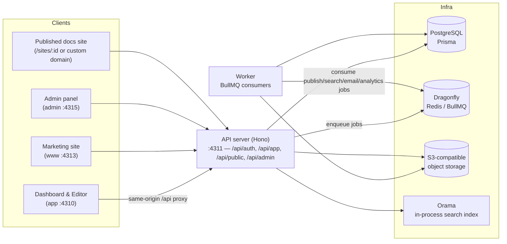

---

## 3. Site map (routes)

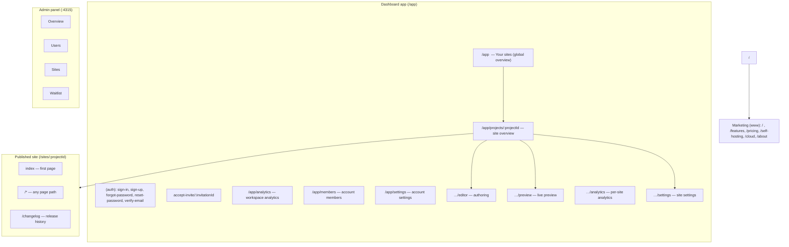

---

## 4. Primary user journey (happy path)

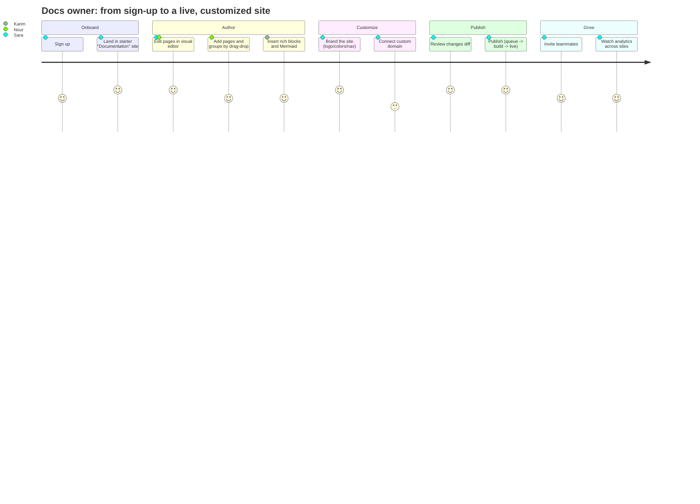

---

## 5. Epics & user stories

Each epic lists stories in the form **"As a <persona>, I want <goal>, so that <value>"** with a flow diagram.

### Epic 1 — Account & Onboarding

**Stories**
- As a new user, I want to **sign up with name/email/password**, so that I get a workspace and can start writing.
- As a returning user, I want to **sign in**, so that I reach my sites.
- As a user who forgot my password, I want to **request a reset link** and **set a new password**.
- As a user on a public instance, I want to **verify my email** (when required).
- As an invited teammate, I want to **accept an invite** and join a site's workspace.
- As a signed-in user, I should **never see the sign-in page** (auto-redirect to `/app`); as a signed-out user, protected routes should **redirect me to sign-in**.

**Acceptance highlights**
- On sign-up, a workspace **and a starter "Documentation" site (5–6 pages) are provisioned** (unique slug — works for every user, not just the first).
- Single-site users are **auto-redirected into their sole project**; multi-site users see the **global "Your sites"** overview.

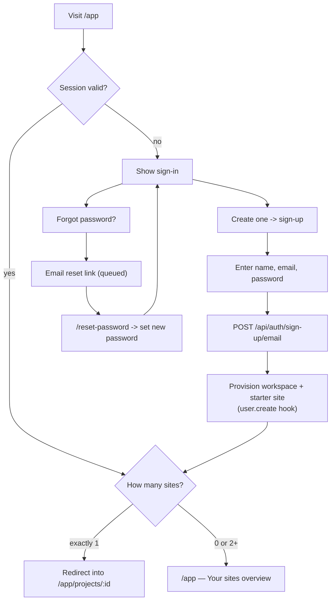

**Sign-up sequence (with provisioning + email):**

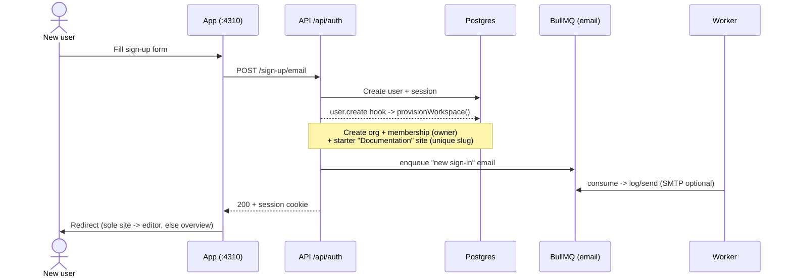

---

### Epic 2 — Workspace & Multi-site management

**Stories**
- As a docs owner, I want a **global overview of all my sites** with aggregated page views & unique visitors, so that I can see performance at a glance.
- As a docs owner, I want to **create a new documentation site** from the dashboard.
- As a docs owner with one site, I want to **land straight in it** without an extra click.
- As a docs owner, I want each site listed with **pages, deploys, and views**.

**Acceptance highlights**
- Global analytics aggregate **across all the user's sites** (each site is its own org; the overview spans every org the user belongs to).
- The "New project" dialog creates a site and drops the user into it.

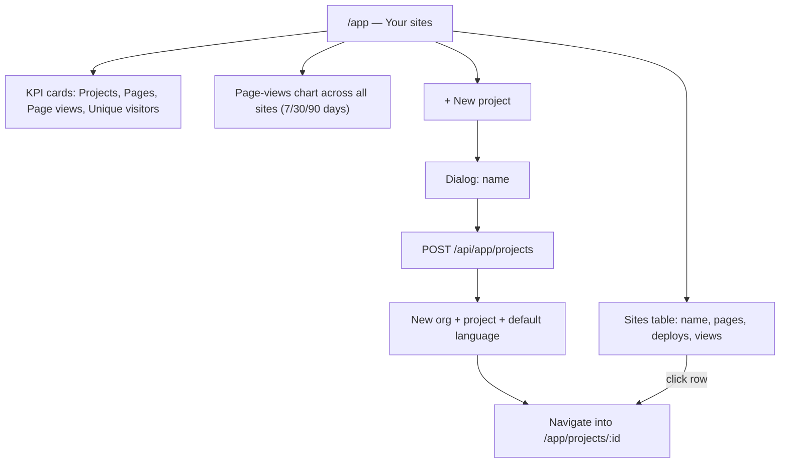

---

### Epic 3 — Content authoring (the editor)

**Stories**
- As a non-technical editor, I want a **visual (WYSIWYG) editor** with a slash menu, so that I can write without Markdown syntax.
- As a technical writer, I want a **raw Markdown mode** and a **rendered preview**, so that I can round-trip content losslessly.
- As an author, I want to **organize pages into groups and reorder them via drag-and-drop**.
- As an author, I want to **insert rich blocks**: headings, lists, task lists, quotes, code blocks, callouts, cards, steps, tabs, accordions, frames, param/response fields, **Mermaid diagrams**, images, tables.
- As an author, I want to **add pages, set page settings** (icon, slug, SEO, layout mode, hidden), and **switch branches/versions**.
- As a reviewer, I want to **leave comments** anchored to content.
- As an author on RTL content, I want the editor content direction to **follow the page's language**.

**Acceptance highlights**
- Content is **Markdown end-to-end**; the TipTap editor round-trips Markdown (never persists ProseMirror JSON).
- Three modes: **Visual / Markdown / Preview**.

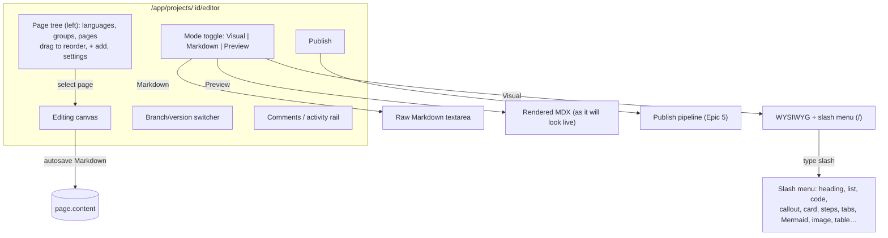

**Content lifecycle (draft vs published):**

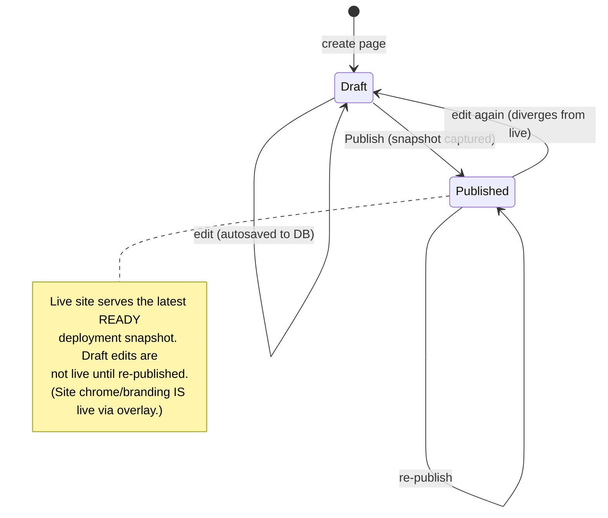

---

### Epic 4 — Customization & Settings

**Stories**
- As a docs owner, I want to set **branding** (light/dark logo, favicon, logo link).
- As a docs owner, I want to control **styling** (primary color, theme default light/dark/system) and **typography**.
- As a docs owner, I want to configure the **navbar** (links, CTA) and **footer** (links, socials).
- As a docs owner, I want to add a **banner**, edit **SEO/metadata**, define **variables** and **redirects**, and tune **search**.
- As a docs owner, I want to set the **deployment name (subdomain)** and **connect a custom domain** (with DNS instructions + verification).
- As a docs owner, I want **analytics** (GA4 / Plausible) with validation and cookie-consent.
- As a docs owner, I want **languages** (add an Arabic/RTL language) and **versions**.
- As a docs owner, I want **exports**, **notifications**, **API keys**, **plan/usage/billing**, and a **danger zone** (delete requires typing the name).

**Acceptance highlights**
- Two surfaces: the editor's **Site settings panel** (Branding, Styling, Typography, Navbar, Footer, Banner, SEO, Search, Variables, Redirects) and the project **/settings** route (General, Custom domain, Authentication, Analytics, Add-ons, Git, Members, API keys, Plan, Usage, Billing, Notifications, Exports, Danger zone).
- **Chrome/branding config is applied to the live site immediately** (overlay); page content/structure still requires a re-publish.

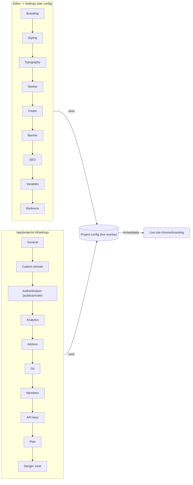

**Custom-domain connect & verify:**

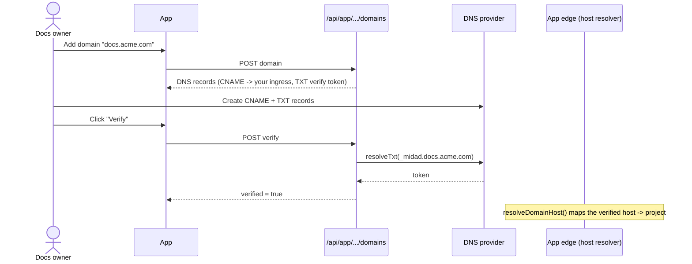

---

### Epic 5 — Publishing

**Stories**
- As a docs owner, I want to **review a diff of changes** since the last version before publishing.
- As a docs owner, I want to **publish** and watch a **live progress pipeline** (Queued → Building snapshot → Indexing search → Live).
- As a docs owner, I want a **success toast with a link to the live site**.
- As a docs owner, I want to **roll back** to the previous version if something's wrong.
- As a reader, I want a **changelog** of releases.

**Acceptance highlights**
- Publish enqueues a job; the worker **builds an immutable snapshot** (`buildSnapshot`) with variables baked in, sets the deployment **READY**, and the search index is (re)built per (project, language, version).
- Deployment states: **PENDING → BUILDING → READY / FAILED**.

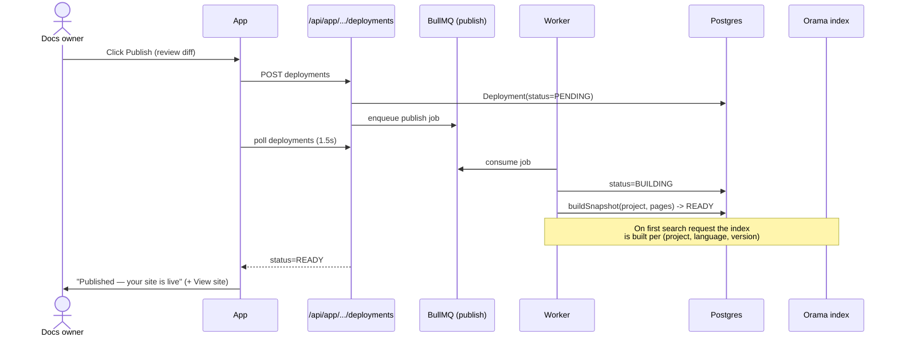

**Deployment lifecycle & rollback:**

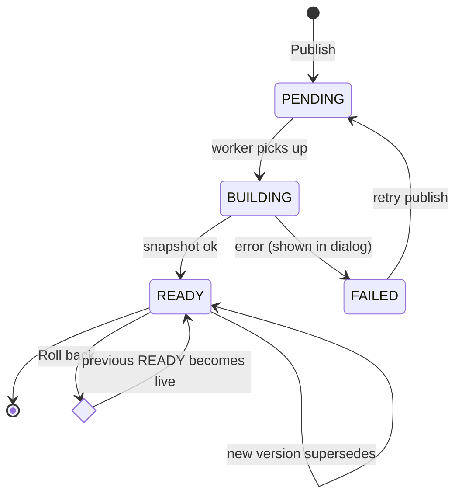

---

### Epic 6 — Live documentation site (reader)

**Stories**
- As a reader, I want a **fast docs site** with a sidebar nav, breadcrumbs, table of contents, and prev/next.
- As a reader, I want **full-text + fuzzy search** with excerpts.
- As a reader, I want to **toggle light/dark theme** (persisted).
- As a reader, I want **rich content**: styled headings (not link-colored), callouts, cards, tabs, code with copy button + filename, Mermaid diagrams, images.
- As an Arabic reader, I want the site rendered **RTL** with correct mirroring; as any reader, I want to **switch language**.
- As a reader on mobile, I want a **hamburger nav drawer** (opening from the correct side per direction).
- As the owner, I want **pageviews/searches tracked** (with optional cookie consent).

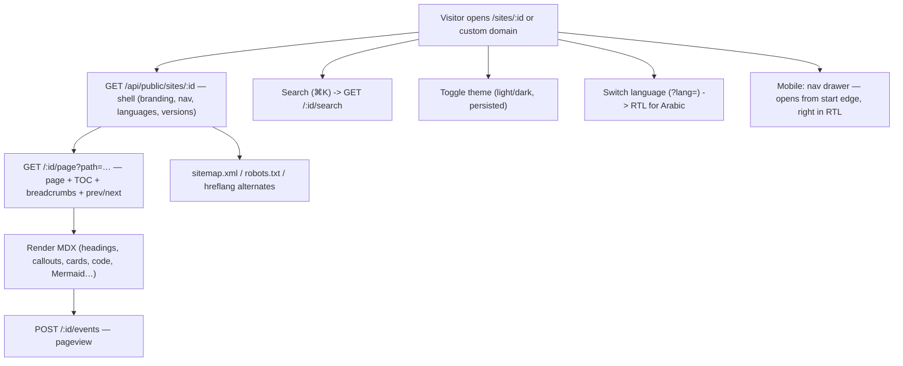

**Reader page-render sequence:**

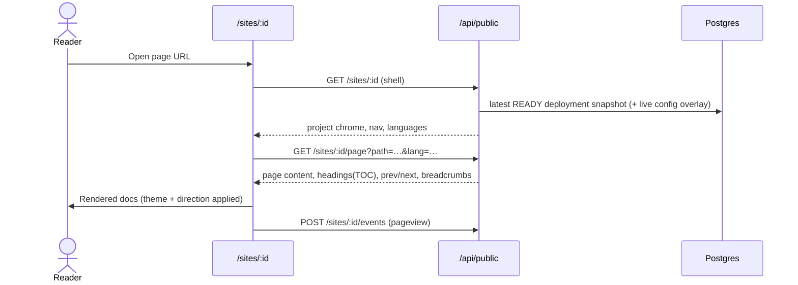

---

### Epic 7 — Team & Members

**Stories**
- As an owner/admin, I want to **invite teammates by email** with a role (member/admin/owner).
- As an owner, I want to **change roles**, **remove members**, and **revoke pending invitations**.
- As an owner, I want to **transfer ownership**.
- As an invitee, I want to **accept an invite** and be added to the site's workspace.

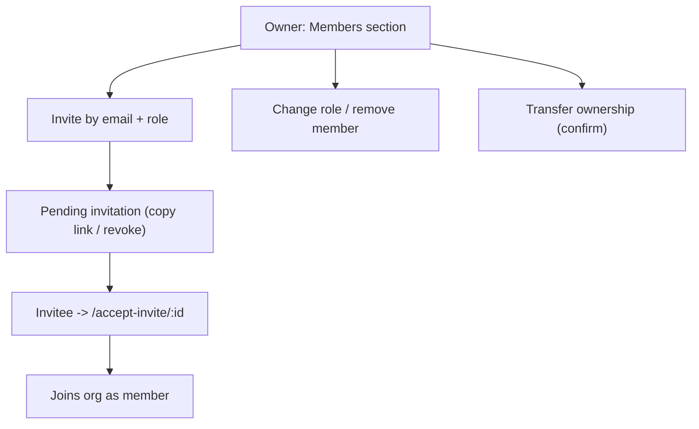

---

### Epic 8 — Internationalization & RTL (Arabic)

**Stories**
- As an Arabic-speaking author, I want the **dashboard & editor UI in Arabic** with correct **RTL mirroring**.
- As an author, I want **English page content to stay LTR** even while the chrome is RTL (direction follows the page's language, not the UI).
- As a reader, I want the **published Arabic site** rendered RTL (nav, TOC, mobile drawer, consent).

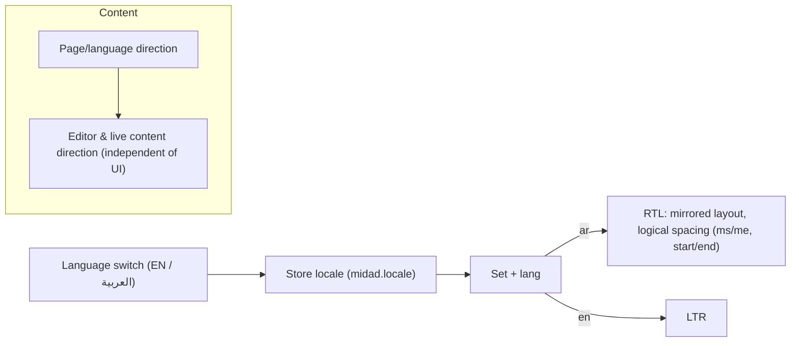

---

### Epic 9 — Platform administration (self-hoster)

**Stories**
- As the operator, I want to **sign in to the admin panel** (platform-admin role only).
- As the operator, I want an **overview** (users, admins, sites, deployments, waitlist, new users).
- As the operator, I want to **manage users** (grant/revoke platform admin).
- As the operator, I want to **see every site across all workspaces**.
- As the operator, I want to **view & export the cloud waitlist**.

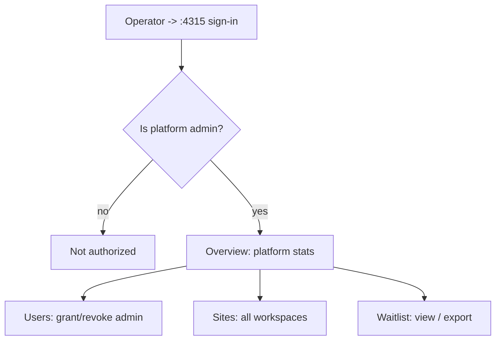

---

### Epic 10 — Self-hosting & operations

**Stories**
- As an operator, I want to **run the whole stack with Docker Compose** (app, api, worker, Postgres, Dragonfly, S3).
- As an operator, I want **health checks** (`/health`) and a **worker jobs dashboard**.
- As an operator, I want **sane env defaults** and clear config (`.env.example`) — including all app origins in `TRUSTED_ORIGINS` and a self-host-safe custom-domain CNAME target.
- As an operator, I want an **upgrade routine** (migrate, restart, verify a publish).

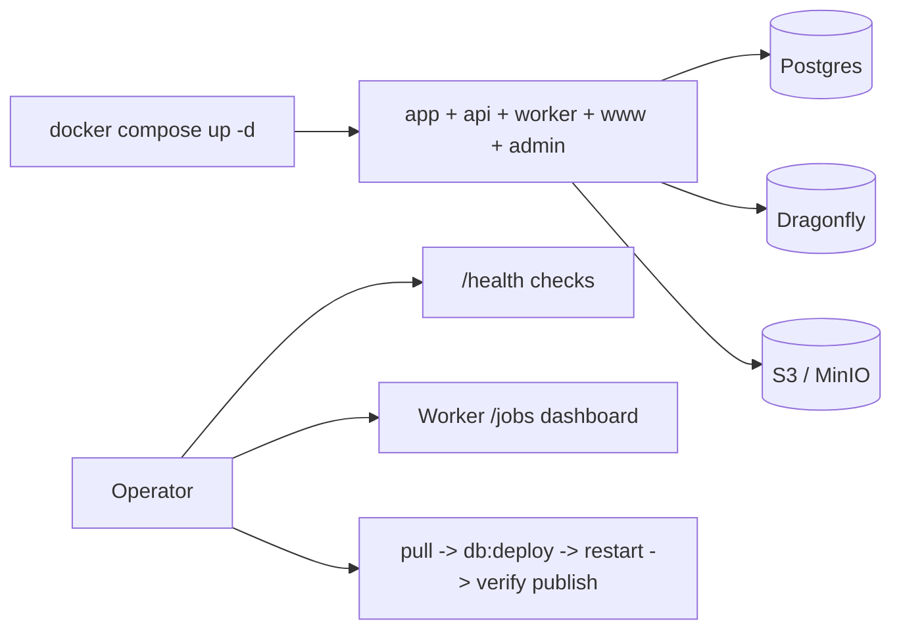

---

## 6. End-to-end: from zero to a live customized site

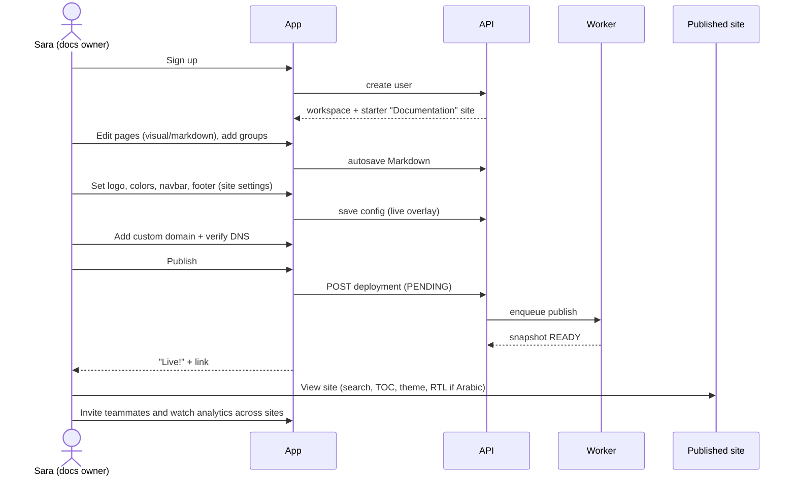

---

## 7. Coverage matrix (persona × capability)

| Capability | Nour (editor) | Karim (tech writer) | Sara (owner) | Omar (operator) | Layla (reader) | Dev (API) |
|---|:--:|:--:|:--:|:--:|:--:|:--:|
| Sign up / in | ✅ | ✅ | ✅ | ✅ | — | — |
| Visual editor | ✅ | ✅ | ✅ | — | — | — |
| Markdown / MDX / Mermaid | ◐ | ✅ | ◐ | — | — | ✅ |
| Page tree / drag-drop | ✅ | ✅ | ✅ | — | — | — |
| Branding / styling | ◐ | ◐ | ✅ | — | — | — |
| Navbar / footer / SEO | — | ◐ | ✅ | — | — | — |
| Custom domain | — | ✅ | ✅ | ◐ | — | — |
| Languages / RTL | ◐ | ✅ | ✅ | — | ✅ (read) | — |
| Publish / rollback | ✅ | ✅ | ✅ | — | — | ◐ |
| Live site: search/TOC/theme | — | — | — | — | ✅ | — |
| Members / roles | — | — | ✅ | — | — | — |
| Analytics | ◐ | ◐ | ✅ | ◐ | — | — |
| Platform admin | — | — | — | ✅ | — | — |
| API keys / SDK | — | ✅ | ◐ | — | — | ✅ |

Legend: ✅ primary · ◐ occasional · — not applicable.

---

### Notes on scope (from dogfooding)

- **Live today:** all flows above are implemented and verified end-to-end (auth, multi-site dashboard + aggregated analytics, editor with Markdown round-trip, full settings/customization surface, publish pipeline with rollback, live site with search/TOC/theme/RTL, members, admin panel, self-host config).
- **Renderable but not yet visually *authorable* (planned):** Tooltip, Icon, ParamField/ResponseField attributes, code-block filename + language picker, callout-variant switcher — these render on the live site but need editor node-views to insert/edit inline (Mermaid + callout-note insertion are done).
- **Planned features:** custom CSS/JS/head injection; external-reader auth (shared-password / JWT / SSO) beyond member-only private sites.
