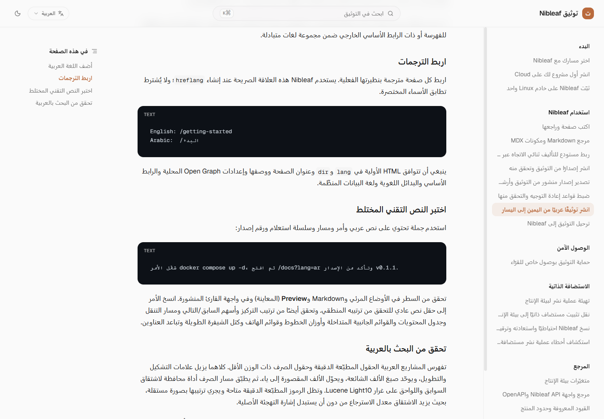
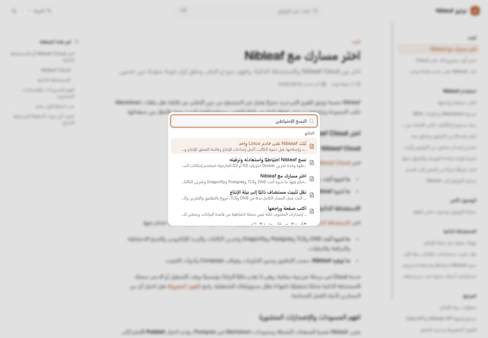

لكل لغة في Nibleaf شجرة صفحات واتجاه خاصان بها. تُعرض واجهة القارئ العربية
من اليمين إلى اليسار (RTL)، بينما تظل الشيفرة المضمّنة وكتل الشيفرة من اليسار
إلى اليمين. لا تنشر إلا ترجمات فعلية، ولا تربط إلا الصفحات المتناظرة حقًا.

## أضف اللغة العربية

افتح عناصر التحكم في لغة شجرة الصفحات، وأضف العربية باستخدام رمز اللغة الصحيح
والاتجاه `rtl`، وحدد اللغة الافتراضية. يمكن أن تستخدم الصفحة العربية اسمًا
مختصرًا وموقعًا مختلفين عن نظيرتها الإنجليزية.

لا تنشئ نسخًا مترجمة فارغة لمجرد جعل الشجرتين متطابقتين. وينبغي ألا يُعلن عن
الصفحات المفقودة أو غير القابلة للفهرسة أو ذات الرابط الأساسي الخارجي ضمن
مجموعة لغات متبادلة.

## اربط الترجمات

اربط كل صفحة مترجمة بنظيرتها الفعلية. يستخدم Nibleaf هذه العلاقة الصريحة عند
إنشاء `hreflang`؛ ولا يُشترط تطابق الأسماء المختصرة.

```text
English: /getting-started
Arabic:  /البدء
```

ينبغي أن تتوافق HTML الأولية في `lang` و`dir` وعنوان الصفحة ووصفها وإعدادات
Open Graph المحلية والرابط الأساسي والبدائل اللغوية ولغة البيانات المنظّمة.

## اختبر النص التقني المختلط

استخدم جملة تحتوي على نص عربي وأمر ومسار وسلسلة استعلام ورقم إصدار:

```text
شغّل الأمر docker compose up -d، ثم افتح /docs?lang=ar وتأكد من الإصدار v0.1.1.
```

تحقق من السطر في الأوضاع المرئي وMarkdown و**Preview** (المعاينة) وفي واجهة
القارئ المنشورة. انسخ الأمر إلى حقل نص عادي للتحقق من ترتيبه المنطقي. وتحقق
أيضًا من ترتيب التركيز وأسهم السابق/التالي ومسار التنقل وجدول المحتويات والقوائم
الجانبية المتداخلة وأوزان الخطوط وقوائم الهاتف وكتل الشيفرة الطويلة وتباعد
العناوين.

<Frame caption="نص عربي مختلط مع أوامر ومسارات لاتينية داخل كتل LTR مع بقاء واجهة الصفحة RTL">
  
</Frame>

## تحقق من البحث بالعربية

<Frame caption="البحث العربي يعيد عناوين ومقاطع عربية من الفهرس الخاص باللغة العربية">
  
</Frame>

[شاهد تبديل اللغة والاتجاه ثم البحث بالعربية](https://raw.githubusercontent.com/lord007tn/nibleaf/37a2068d9736abb0219809f3ab841ecf8f927f1b/docs/assets/bilingual/arabic-language-search.webm)
في تسجيل قصير من البيئة المحلية المعزولة.

تفهرس المشاريع العربية الحقول المطبّعة الدقيقة وحقول الصرف ذات الوزن الأقل.
كلاهما يزيل علامات التشكيل والتطويل، ويوحّد صيغ الألف الشائعة، ويحوّل الألف
المقصورة إلى ياء. ثم يطبّق مسار الصرف أداة محافظة لاشتقاق السوابق واللواحق على
غرار Lucene Light10. وتظل الرموز المطبّعة الدقيقة متاحة ويجري ترتيبها بصورة
مستقلة، بحيث يزيد الاشتقاق معدل الاسترجاع من دون أن يستبدل إشارة التهجئة الأصلية.

هذه ليست عملية استرجاع دلالي، ولا استخراجًا للجذر الثلاثي، ولا إرجاعًا عامًا
إلى الصيغة المعجمية. تُستبعد الرموز القصيرة والشيفرة والمعرّفات المختلطة بين
العربية واللاتينية والكلمات المحمية الملتبسة من المعالجة الصرفية. تظل العبارات
الدقيقة أقوى إشارة، وتضيف المسارات المعجمية والصرفية والتقريبية المحدودة نتائج
إضافية.

اختبر الكلمات مع التشكيل ومن دونه، وصيغ الألف المختلفة، والتطويل، والسوابق
واللواحق الشائعة، وصيغ المفرد والجمع، والعبارات التقنية الدقيقة، وأسماء المنتج
المكتوبة بالحرفين العربي واللاتيني. وأضف استعلامات سلبية يجب ألا تجد نتائج.
استخدم مفردات حقيقية من الصفحات، لا قوائم مصطنعة من الكلمات المفتاحية.
