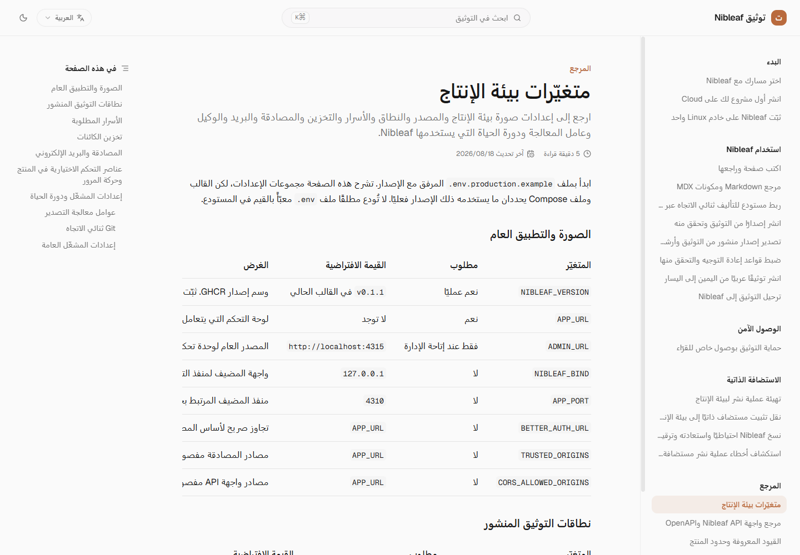

ابدأ بملف `.env.production.example` المرفق مع الإصدار. تشرح هذه الصفحة مجموعات
الإعدادات، لكن القالب وملف Compose يحددان ما يستخدمه ذلك الإصدار فعليًا. لا
تُودع مطلقًا ملف `.env` معبّأً بالقيم في المستودع.

## الصورة والتطبيق العام

<Frame caption="جدول متغيّرات البيئة العربي مع إبقاء المعرّفات والقيم التقنية باتجاه LTR">
  
</Frame>

| المتغيّر | مطلوب | القيمة الافتراضية | الغرض |
| --- | --- | --- | --- |
| `NIBLEAF_VERSION` | نعم عمليًا | `v0.1.2` في القالب الحالي | وسم إصدار GHCR. ثبّت إصدارًا موجودًا، وتجنب الوسوم المتحركة. تُنشر وسوم الإصدار عبر سير عمل Docker اليدوي؛ تحقّق من وجود الوسم المختار قبل الترقية. |
| `APP_URL` | نعم | لا توجد | لوحة التحكم التي يتعامل معها المتصفح، ومصدر المصادقة المعتاد، من دون شرطة مائلة في النهاية. |
| `ADMIN_URL` | فقط عند إتاحة الإدارة | `http://localhost:4315` | المصدر العام لوحدة تحكم المشغّل الاختيارية. |
| `NIBLEAF_BIND` | لا | `127.0.0.1` | واجهة المضيف لمنفذ التطبيق. أبقِها على loopback عندما يكون الوكيل محليًا. |
| `APP_PORT` | لا | `4310` | منفذ المضيف المرتبط بحاوية التطبيق. |
| `BETTER_AUTH_URL` | لا | `APP_URL` | تجاوز صريح لأساس المصادقة. |
| `TRUSTED_ORIGINS` | لا | `APP_URL` | مصادر المصادقة مفصولة بفواصل. |
| `CORS_ALLOWED_ORIGINS` | لا | `APP_URL` | مصادر واجهة API مفصولة بفواصل. |

## نطاقات التوثيق المنشور

| المتغيّر | مطلوب | القيمة الافتراضية | الغرض |
| --- | --- | --- | --- |
| `SITE_BASE_DOMAIN` | لا | فارغة | يفعّل النشر على `<project>.<base-domain>`؛ ويتطلب DNS وTLS بحرف بدل. |
| `CUSTOM_DOMAIN_CNAME_TARGET` | لا | `SITE_BASE_DOMAIN` | هدف CNAME يديره المشغّل ويظهر لمالكي النطاقات المخصّصة. |
| `CUSTOM_DOMAIN_PROVIDER` | لا | `ingress` | استراتيجية أتمتة النطاقات المخصّصة التي يدعمها الإصدار. |
| `CLOUDFLARE_SAAS_ZONE_ID` | عند استخدام Cloudflare for SaaS | فارغة | معرّف المنطقة لأسماء المضيفين المخصّصة المُدارة. |
| `CLOUDFLARE_SAAS_API_TOKEN` | عند استخدام Cloudflare for SaaS | فارغة | رمز محدود النطاق لعمليات أسماء المضيفين المخصّصة. |
| `CLOUDFLARE_SAAS_WORKER_SCRIPT` | لا | `nibleaf-custom-domain-edge` | اسم سكربت عامل الحافة. |
| `CUSTOM_DOMAIN_EDGE_SECRET` | لمسار الحافة المُدار | فارغة | سر مشترك للمصادقة من الحافة إلى المصدر. |

## الأسرار المطلوبة

| المتغيّر | مطلوب | الغرض |
| --- | --- | --- |
| `BETTER_AUTH_SECRET` | نعم | يوقّع حالة المصادقة. أنشئه بصورة مستقلة باستخدام `openssl rand -hex 32`. |
| `POSTGRES_PASSWORD` | نعم | كلمة مرور مستخدم قاعدة بيانات Nibleaf المضمّنة. |
| `INTERNAL_API_SECRET` | موصى به بشدة | يصادق تلميحات التطبيق الموثوقة المرسلة إلى واجهة API والمستخدمة لتحديد المعدل بدقة. |

## تخزين الكائنات

| المتغيّر | مطلوب | القيمة الافتراضية | الغرض |
| --- | --- | --- | --- |
| `STORAGE_PROVIDER` | لا | `maxio` | سلوك المزوّد مثل `maxio` أو `r2` أو وضع آخر مدعوم ومتوافق مع S3. |
| `STORAGE_ENDPOINT` | للتخزين الخارجي | `http://maxio:9000` | نقطة النهاية من الخادم إلى التخزين. |
| `STORAGE_PUBLIC_ENDPOINT` | نعم | لا توجد | المصدر المتاح للمتصفح والمستخدم للطلبات الموقّعة مسبقًا. |
| `STORAGE_ACCESS_KEY_ID` | نعم | لا توجد | معرّف الوصول إلى الحاوية. |
| `STORAGE_SECRET_ACCESS_KEY` | نعم | لا توجد | سر الحاوية. أنشئه بصورة مستقلة. |
| `STORAGE_BUCKET` | لا | `nibleaf` | حاوية الأصول وعمليات التصدير. |
| `STORAGE_REGION` | لا | `auto` | قيمة منطقة S3. |
| `STORAGE_FORCE_PATH_STYLE` | لا | `true` | استخدام عناوين URL للحاوية بنمط المسار؛ يستخدم AWS S3 عادةً `false`. |
| `STORAGE_PUBLIC_URL` | موصى به | فارغة | الأساس العام للأصول، وغالبًا ما يكون عنوان URL للحاوية أو CDN. |
| `STORAGE_CORS_ALLOWED_ORIGINS` | لا | `APP_URL` | مصادر المتصفح المسموح لها بالرفع مباشرة. |
| `STORAGE_AUTO_CORS` | لا | `true` | السماح لـNibleaf بتهيئة CORS المدعوم للحاوية تلقائيًا. |
| `MAXIO_SECURE_COOKIES` | لا | `true` | اشتراط HTTPS لملفات تعريف الارتباط في وحدة تحكم maxio المضمّنة. |

## المصادقة والبريد الإلكتروني

| المتغيّر | مطلوب | القيمة الافتراضية | الغرض |
| --- | --- | --- | --- |
| `DISABLE_SIGNUP` | لا | `false` | إغلاق التسجيل الجديد مع إبقاء تسجيل الدخول للحسابات الحالية. |
| `GOOGLE_CLIENT_ID`, `GOOGLE_CLIENT_SECRET` | لتسجيل الدخول عبر Google | فارغة | بيانات اعتماد عميل OAuth. |
| `EMAIL_FROM` | للتسليم | `nibleaf@localhost` | مُرسِل تم التحقق منه لدى المزوّد. |
| `POSTMARK_API_KEY` | عند استخدام Postmark | فارغة | رمز الخادم؛ ويُفضّل عند ضبطه. |
| `POSTMARK_MESSAGE_STREAM` | لا | فارغة | تدفق Postmark. |
| `SMTP_URL` | لاستخدام SMTP كخيار احتياطي | فارغة | عنوان URL الكامل لاتصال SMTP. احمه بوصفه سرًا. |
| `EMAIL_DELIVERY_REQUIRED` | لا | `true` في الإنتاج | إرجاع حالة عامل غير سليمة وإفشال مهام البريد في قائمة الانتظار عند عدم إعداد أي مزوّد. |

### مصادقة Google OAuth

أنشئ عميل OAuth من نوع **تطبيق ويب** في Google Cloud، ثم اضبط ما يلي:

- مصدر JavaScript المسموح: قيمة `APP_URL` نفسها، مثل `https://nibleaf.example.com`.
- عنوان إعادة التوجيه المسموح: `${APP_URL}/api/auth/callback/google`.
- `GOOGLE_CLIENT_ID` و`GOOGLE_CLIENT_SECRET`: بيانات اعتماد العميل المطابقة.

يجب أن يكون المتغيّران موجودين وغير فارغين بعد إزالة المسافات المحيطة. يخفي Nibleaf زر Google عند غياب أي منهما حتى لا يدخل القارئ في مسار تسجيل دخول غير مكتمل. أعد تشغيل التطبيق بعد تغيير هذه القيم على الخادم.

## عناصر التحكم الاختيارية في المنتج وحركة المرور

| المتغيّر | مطلوب | القيمة الافتراضية | الغرض |
| --- | --- | --- | --- |
| `OPENAI_API_KEY` | فقط للمساعدة بالذكاء الاصطناعي | فارغة | يفعّل إجراءات الكتابة الصريحة بالذكاء الاصطناعي. |
| `AI_DAILY_LIMIT` | لا | القيمة الافتراضية للتطبيق | الحد اليومي لطلبات الذكاء الاصطناعي لكل مساحة عمل؛ وتعطّل القيمة `0` إنشاء المسودات. |
| `MARKETING_GA4_ID` | لا | فارغة | معرّف قياس GA4 لصفحات التسويق العامة في النسخة. يظهر كبيانات عامة، ولا تُحمّل «إحصاءات Google» إلا بعد موافقة الزائر الصريحة؛ حدّث إشعار الخصوصية قبل تفعيله. |
| `RATE_LIMIT_PUBLIC_PER_MIN` | لا | القيمة الافتراضية للتطبيق | عدد طلبات تقديم الموقع العام لكل عنوان في الدقيقة. |
| `TRUSTED_PROXY_HOPS` | لا | `0` | عدد الوكلاء العامين الموثوقين الذين يضيفون إلى سلسلة التمرير. |

## إعدادات المشغّل ودورة الحياة

### عوامل معالجة التصدير

| المتغيّر | مطلوب | القيمة الافتراضية | الغرض |
| --- | --- | --- | --- |
| `EXPORT_CHROMIUM_PATH` | لملفات PDF خارج الصورة الرسمية | `/usr/bin/chromium-browser` | ملف تنفيذي متوافق مع Chromium ومستخدم لتصيير PDF. |
| `EXPORT_CONCURRENCY` | لا | `2` | مهام التصدير التي يعالجها عامل معالجة واحد؛ النطاق المقبول من 1 إلى 8. |
| `EXPORT_MAX_ACTIVE_PER_PROJECT` | لا | `3` | عمليات التشغيل المتزامنة للمشروع التي تقبلها واجهة API. |
| `EXPORT_MAX_DAILY_PER_PROJECT` | لا | `20` | الحد اليومي لعمليات التشغيل لكل مشروع. |
| `EXPORT_MAX_PAGES` | لا | `5000` | الحد الأقصى للصفحات المنسوخة في لقطة تصدير واحدة غير قابلة للتغيير. |
| `EXPORT_MAX_SNAPSHOT_BYTES` | لا | `52428800` | الحد الأقصى لحجم اللقطة المتسلسلة بالبايت. |
| `EXPORT_MAX_ASSET_BYTES` | لا | `262144000` | الحد الأقصى لحجم الأصول المشار إليها والمنسوخة إلى أثر، بالبايت. |
| `EXPORT_MANUAL_RETENTION_DAYS` | لا | `7` | مدة الاحتفاظ بعمليات التصدير التي تُنفّذ مرة واحدة. |
| `EXPORT_DOWNLOAD_TTL_SECONDS` | لا | `300` | مدة صلاحية التنزيل الموقّع مسبقًا؛ النطاق المقبول من 30 إلى 900 ثانية. |

تتضمن الصورة الرسمية Chromium. إذا كان `WORKER_QUEUES` قائمة سماح مفصولة
بفواصل، فأدرج `export`؛ وتفعّل القيمة الفارغة كل طوابير المهام.

### Git ثنائي الاتجاه

| المتغيّر | مطلوب | القيمة الافتراضية | الغرض |
| --- | --- | --- | --- |
| `GIT_CREDENTIAL_ENCRYPTION_KEY` | لتفعيل Git ثنائي الاتجاه | لا توجد | 32 بايت بالضبط بترميز base64؛ يشفّر بيانات اعتماد المزوّد وأسرار webhook. |
| `GIT_WORKER_SECRET` | لتفعيل Git ثنائي الاتجاه | لا توجد | 32 محرفًا على الأقل، مشتركة بين واجهة API وعامل المعالجة لعمليات رد النداء المبهمة. |
| `GIT_CONCURRENCY` | لا | `2` | عمليات Git التي يعالجها عامل معالجة واحد. |

أنشئ السرّين بصورة مستقلة. لا تدوّر مفتاح التشفير في مكانه: لا يمكن فك النص
المشفّر الحالي بمفتاح جديد. اتبع [إجراء تدوير تأليف Git](/ar/git-authoring).
وإذا كان `WORKER_QUEUES` مضبوطًا، فأدرج `git`.

### إعدادات المشغّل العامة

| المتغيّر | مطلوب | القيمة الافتراضية | الغرض |
| --- | --- | --- | --- |
| `WORKBENCH_USER`, `WORKBENCH_PASS` | موصى بهما | فارغة | المصادقة الأساسية لعمليات عامل المعالجة على المنفذ 4312. |
| `NIBLEAF_RUN_SEED` | لا | `false` | إدخال محتوى تجريبي أثناء الترحيل؛ أبقِه على false في بيئة الإنتاج. |
| `SERVER_SHUTDOWN_TIMEOUT_MS` | لا | `25000` | مهلة تصريف واجهة API بالميلي ثانية. |
| `NIBLEAF_SHUTDOWN_GRACE` | لا | `30s` | فترة السماح لإيقاف الحاوية؛ أبقِها أطول من مهلة الخادم. |

بعد تغيير المصادر أو الأسرار أو التخزين، أعد إنشاء الخدمات المتأثرة وكرّر فحوص
مسار العمل الواردة في [جاهزية بيئة الإنتاج](/ar/self-hosting/production).
