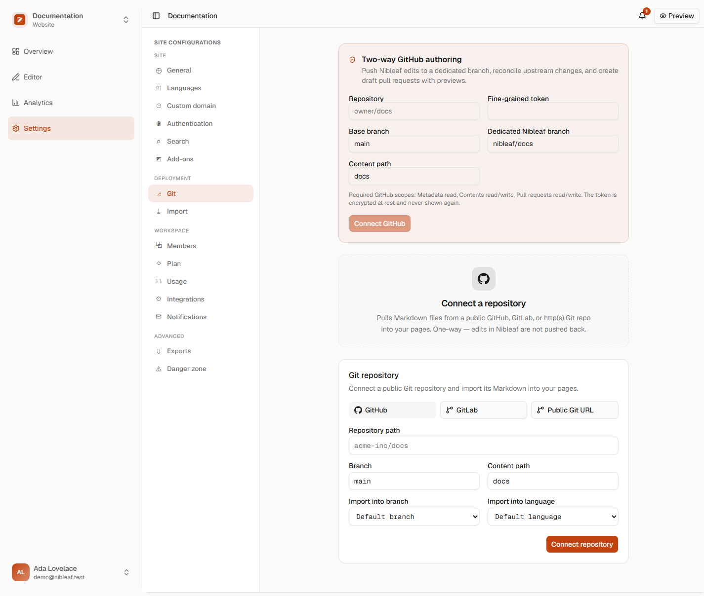
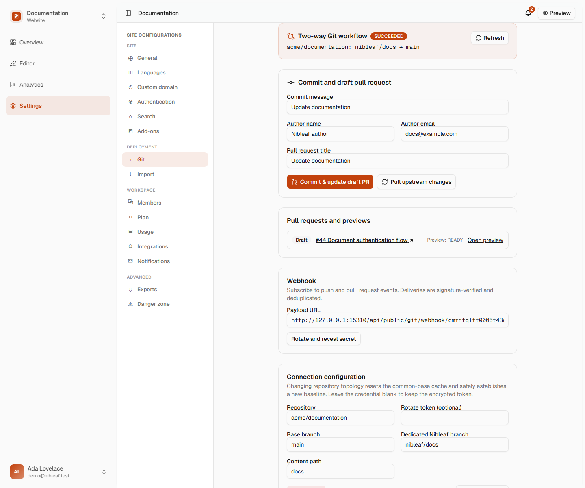
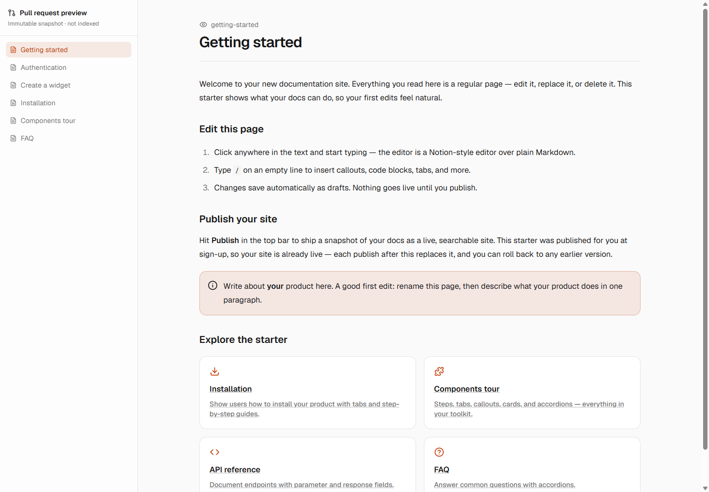
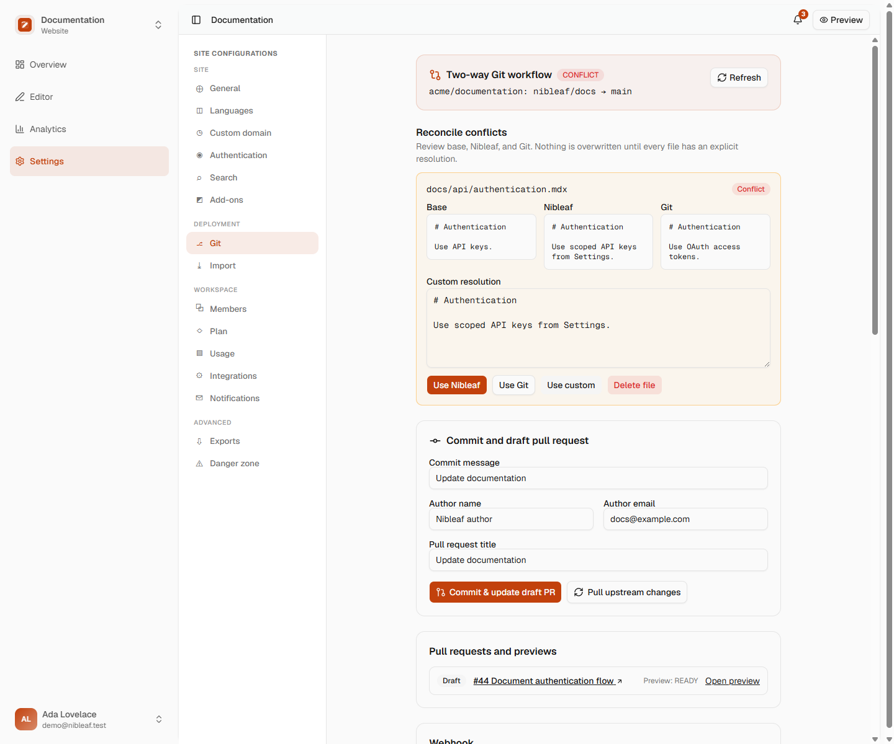
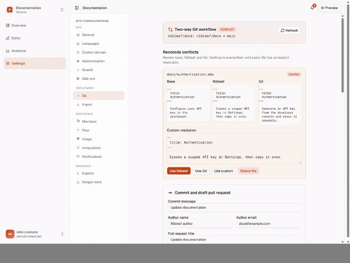

Nibleaf can import a repository as before, or connect a GitHub repository for two-way authoring. In two-way mode, browser edits are committed to a dedicated branch, a draft pull request is created or updated, upstream changes are reconciled, and each pull request receives an immutable, noindex preview.

## Instance setup

Apply the database migration before enabling the UI:

```sh
pnpm db:deploy
```

Configure two independent secrets on the API and worker services:

```sh
# Exactly 32 bytes, base64 encoded. Encrypts provider credentials and webhook secrets.
openssl rand -base64 32

# At least 32 characters. Authenticates opaque worker callbacks to the API.
openssl rand -hex 32
```

Set the results as `GIT_CREDENTIAL_ENCRYPTION_KEY` and `GIT_WORKER_SECRET`. `GIT_CONCURRENCY` defaults to `2`. If `WORKER_QUEUES` is an allowlist, include `git`. Restart the API and worker after changing these values.

Do not rotate `GIT_CREDENTIAL_ENCRYPTION_KEY` in place: existing ciphertext cannot be decrypted with a new key. To rotate it, first disconnect or re-encrypt every Git connection in a controlled migration, deploy the new key, and reconnect credentials. Rotating `GIT_WORKER_SECRET` only requires deploying the same new value to the API and worker together.

## GitHub credential and repository setup

Create a fine-grained personal access token or installation credential restricted to the connected repository. Grant only:

- Metadata: read
- Contents: read and write
- Pull requests: read and write

No Actions, administration, issues, organization, or user scopes are required. Paste the token once in **Site settings → Git**. Nibleaf verifies write access, encrypts the token with AES-256-GCM, stores a non-secret fingerprint for operators, and never returns or logs the token.

Choose a base branch (normally `main`), a distinct dedicated authoring branch (for example `nibleaf/docs`), the repository-relative documentation path, and the Nibleaf branch/language to map. Nibleaf never force-pushes. Branch updates use compare-and-swap semantics and stop if the remote ref changes during a push.

## Webhook setup

In the GitHub repository, add the payload URL shown by Nibleaf:

```text
https://YOUR_NIBLEAF_ORIGIN/api/public/git/webhook/PROJECT_ID
```

Use `application/json`, paste the secret generated or rotated in the Git panel, enable SSL verification, and subscribe to **Pushes** and **Pull requests**.

GitHub deliveries are verified against the exact raw request bytes using `X-Hub-Signature-256`. `X-GitHub-Delivery` is stored with a payload hash, so replayed deliveries are acknowledged idempotently and a reused delivery ID with different bytes is rejected. Webhook bodies and credentials are not placed in Redis; jobs contain only an opaque operation ID.

Existing public GitHub/GitLab one-way connections remain readable and keep their legacy webhook behavior until an admin adds an encrypted two-way GitHub connection.

## Commit, pull request, and preview behavior

Authors with the site `member` role or higher may queue pushes, pull upstream changes, and resolve conflicts. Repository credentials, webhook rotation, connection changes, and disconnects require `admin` or `owner`.

Every push includes an idempotency key, commit message, author name, and author email. Reusing the key with the same request returns the existing operation; reusing it with different input is rejected. Commit creation, branch updates, pull-request upserts, previews, webhooks, and worker retries all converge on durable database records.

The GitHub adapter creates or updates one draft pull request for the configured head/base pair. The UI shows changed files, durable operation status, PR state, and preview lifecycle (`PENDING`, `BUILDING`, `READY`, `FAILED`, or `SUPERSEDED`). READY previews are immutable snapshots at an unguessable URL and send `noindex, nofollow`; closing a PR supersedes its active preview.

## Visual walkthrough

The Git panel explains the least-privilege GitHub scopes and keeps the base and dedicated authoring branches explicit when an administrator connects a repository.



After a push, the same panel surfaces the durable operation, commit attribution, changed files, draft pull request, and preview lifecycle.



The public preview renders the immutable pull-request snapshot independently from the authoring workspace.



## Conflict semantics

Each tracked file stores the last common base. Before changing either side, Nibleaf compares:

- **base**: the last version accepted by both systems;
- **ours**: the current Nibleaf page serialization;
- **theirs**: the current file from Git.

If only one side changed, that change is preserved automatically. Identical edits converge. File additions and deletions are first-class states, not empty strings. If both sides changed differently, the operation moves to `CONFLICT` and no repository ref or Nibleaf page is overwritten.

For every conflicted file, the UI displays complete base/ours/theirs content. An author must explicitly choose Nibleaf, Git, custom content, or custom deletion. Once all files are resolved, the same durable operation is retried. A second remote ref check still runs immediately before update, so changes that arrive during reconciliation cannot be silently lost.



The following short recording shows an explicit per-file resolution and the operation returning to the durable queue. No side is changed before the author selects a resolution.



## Operational recovery

- **QUEUED for too long:** verify Redis, ensure the worker runs the `git` queue, and confirm `GIT_WORKER_SECRET` matches on API and worker. Re-queueing the same operation is safe.
- **FAILED with 401/403:** rotate the repository credential with the documented least-privilege permissions. Provider error messages are bounded and secret-free.
- **Remote branch changed:** pull upstream changes, resolve any conflicts, then submit a new idempotent push. Nibleaf never force-pushes around this error.
- **Preview failed:** inspect the operation/preview error in the Git panel, fix the content or infrastructure issue, and update the draft PR. The source-SHA uniqueness key prevents duplicate builds.
- **Webhook retries:** GitHub may redeliver the same ID safely. If Redis was unavailable, redelivery queues the same idempotency key.
- **Lost webhook secret:** rotate it in Nibleaf, immediately update the GitHub webhook, and use GitHub's redelivery action for missed events.
- **Lost encryption key:** encrypted credentials are intentionally unrecoverable. Set a new key and reconnect every affected repository; provider tokens should also be revoked and replaced.

Sensitive actions are written to the Git audit table with actor, project, action, timestamp, and bounded secret-free metadata. Disconnect is additionally mirrored to the platform event stream before credential rows are deleted.
