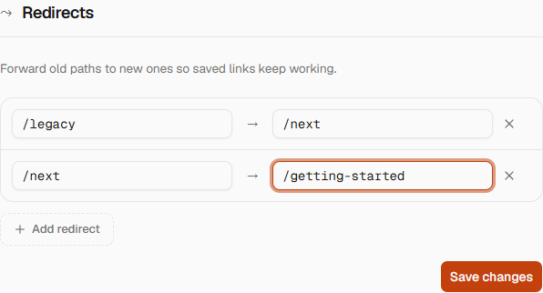
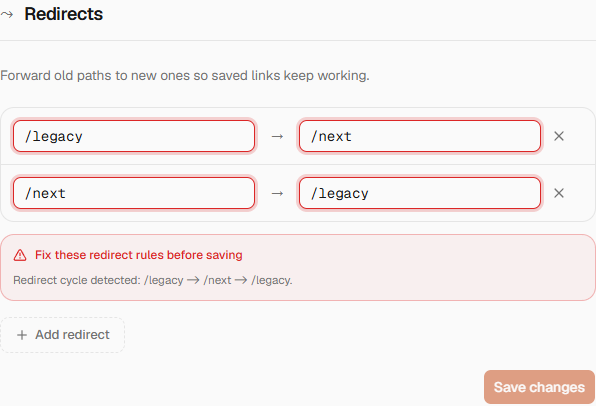
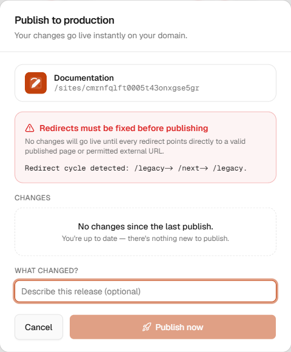

Redirects are configured per site in **Editor → Site configuration → Redirects**. They are part of an immutable deployment snapshot: editing a redirect does not change the live site until the next successful publish.

## Accepted sources and destinations

- A source is a site-relative path such as `/old-guide`. Do not include the Nibleaf app prefix (`/sites/<project-id>`), a custom domain, a query string, or a fragment.
- Leading and trailing slashes are normalized. Percent-encoded Unicode is treated as its decoded equivalent. Dot segments, backslashes, control characters, invalid percent escapes, and encoded path separators are rejected.
- An internal destination is a site-relative path and may include a query string and fragment, for example `/guide?lang=ar#install`.
- An external destination must be an absolute `http://` or `https://` URL with a hostname. Protocol-relative URLs, credentials in URLs, and other schemes are rejected.
- Sources must be unique after normalization and cannot point to themselves or collide with a published page, group/root alias, version route, or reserved site route.

## Graph and publish behavior

- A site can store at most 100 redirect rules.
- Internal chains may contain at most 10 hops and must be acyclic.
- At publish time every internal chain is resolved to its final renderable page. The snapshot stores a direct redirect, including canonical resolution of group/root aliases and non-default version prefixes.
- For an internal final destination, the last explicitly configured query string and fragment in a chain win; an earlier value is retained when later hops do not replace it. An external final destination is emitted exactly as configured.
- A configured `lang` query must name an enabled locale and the destination must exist in that locale. Without an explicit `lang`, validation uses the default locale; the reader preserves the visitor's current locale when issuing the redirect.
- Hidden pages, disabled locales, deleted pages, and paths absent from the effective snapshot are not valid internal destinations. Use an allowed external URL when the destination intentionally leaves the site.
- Redirect responses use permanent HTTP `308`, preserving the original request method according to the existing published-site behavior.

The editor reports syntax and graph errors before saving. The publish dialog performs a route-aware preflight against the effective pages, locales, and versions. The API repeats that preflight before creating a deployment, and the worker validates again immediately before marking a snapshot READY. Any failure leaves the previous READY deployment live; no partial redirect configuration is published.

## Editor and publish feedback

[Watch the 20-second redirect validation interaction](./assets/redirects/redirect-validation-flow.webm) to see row-level feedback update while a cycle is entered.

A valid internal chain is accepted in the editor. It is flattened to direct redirects in the immutable snapshot during publish.

Cycles highlight every involved row and show the complete path sequence before saving.

Route-aware validation is repeated in the publish dialog. Publishing remains disabled until the graph is valid, so the current READY deployment stays live.

